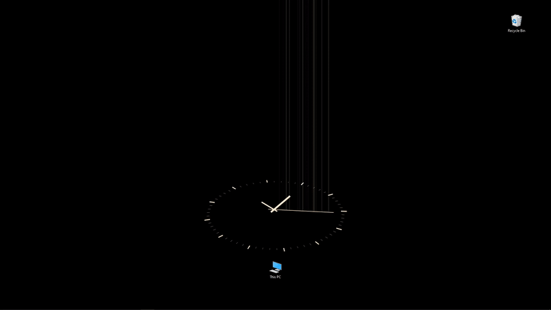

# InterstellarClock
Display clock animation in the desktop background for Windows 8+.
 **NOTE: EVEN IF YOU HAVE WINDOWS 8+, THE PROGRAM MIGHT NOT EVEN RUN BECAUSE OF THE BACKGROUND DETECTION MECHANISM I WROTE MAY NOT WORK IN SOME MACHINE**

# Run the program to test only
1. Download _InterstellarClock.exe_ and _config.txt_ file in the **/bin/** folder.
2. Put them in anywhere you want, but two files gotta be at the same folder so that the configuration could take effect.
3. You could omit downloading _config.txt_ file, doing so will let the program runs at the default settings.
4. Run the _.exe_ file. 
5. After running, if you want to stop it, you gotta end the program in **Task Manager**, or logout, because I'm too lazy to implement the off button...

# How to set the background automatically during startup
You could create the shortcut of the program in the your machine's startup folder.
